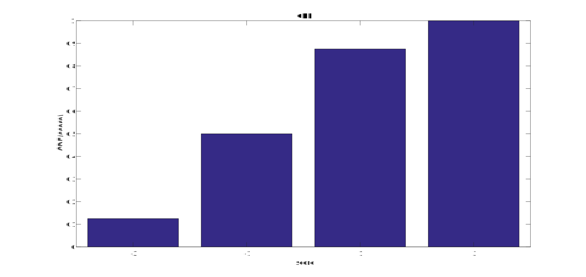
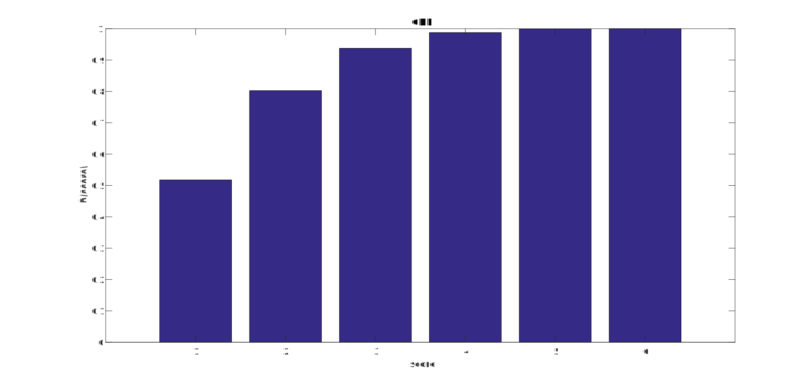

# Week 4 Questions

Q1  
a) If $Y = 2$, that means the sum of the dice is 2, which is only true for one outcome -> **{(1,1)}**  
b) Similarly for $Y = 3$, **{(1,2), (2,1)}**  
c) For $Y = 4$, **{(1,3), (2,2), (3,1)}**  
d) There are 3 possible outcomes where $X = 1$, out of a total of $6^2$ possibilities, which gives us $\frac{3}{36} = 0.083$

Q2  
a) The possible values of X are {-3, -1, 1, 3}, ie No heads, one heads, two heads, and three heads.  
b) There are 8 ($2^3$) possible outcomes when flipping a coin three times. The chance that X = -3 is the same as the chance all coin flips landed Tails, which is only one outcome, so P(X = -3) = **0.125**  
c) The chance that X = -1 is the same as the chance that there is one Heads out of the three tosses. Using permutations, we get $\frac{3!}{2!} = 3$ possible outcomes, so P(X = -1) = **0.375**  
d) PMF
-   P(X = -3) = 0.125
-   P(X = -1) = 0.375
-   P(X = 1) = 0.375
-   P(X = 3) = 0.125

CDF
-   P(X <= -3) = 0.125
-   P(X <= -1) = 0.5
-   P(X <= 1) = 0.875
-   P(X <= 3) = 1

Q3  
a) Every roll will be either 1 or greater, so the minimum value cannot be lower than one. $P(X \ge 1) = 1$  
b) This is the same as the chance the none of the rolls are a 1. There are $5^4$ possible outcomes where there are no 1s. Which means $P(X \ge 2) = \frac{5^4}{6^4} = 0.4823$  
c) CDF
-   $P(X \le 1) = 1-P(X \ge 2) = 0.5177$
-   $P(X \le 2) = 1-P(X \ge 3) = 0.8025$
-   $P(X \le 3) = 1-P(X \ge 4) = 0.9375$
-   $P(X \le 4) = 1-P(X \ge 5) = 0.9877$
-   $P(X \le 5) = 1-P(X \ge 6) = 0.9992$
-   $P(X \le 6) = 1$

